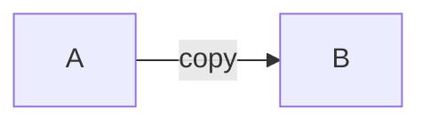
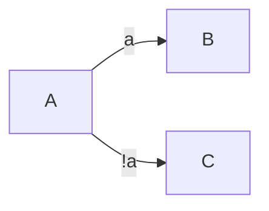
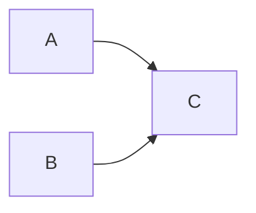
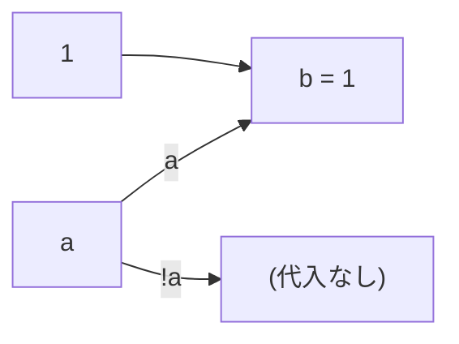
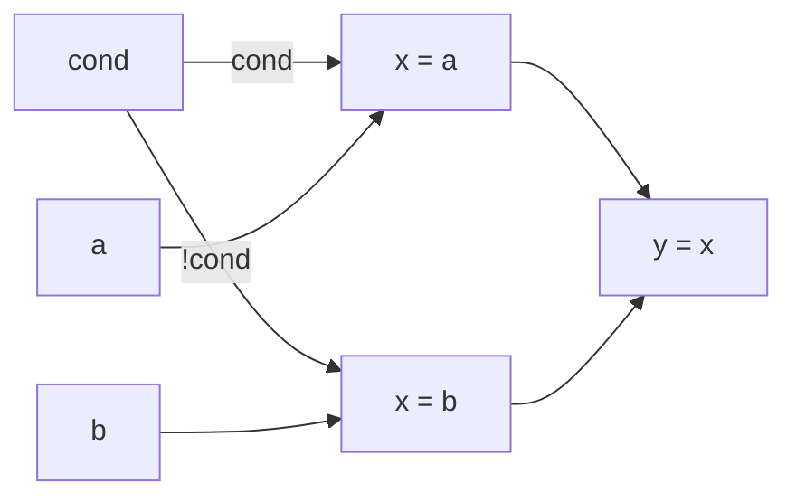

# 来歴射影パラダイム(PPP) 設計案 — 基盤編

## まえがき

**本書の性格**

本書は、来歴射影パラダイム(Provenance Projection Paradigm、以下PPP)という設計案を整理した思想書である。検証はまだこれからで、実装や十分な例による裏付けには至っていない。精緻な定義を備えた設計案という体裁を取ってはいるが、強度としては「思想書」に近い段階にあると理解してほしい。

PPPの基盤を本書で扱い、PPPを採用した場合に得られる諸々の帰結(副次効果)は別記事にて扱う。

**書いた動機**

もともとはコンパイラを単純化したい、という動機だけから出発した。意味解析や最適化に関わる複数の制度(型、エフェクト、並列性、メモリ管理など)が別々に実装されている状況を、もっと単純な一つの基盤に落とせないか、という問題意識があった。

書き進めるうちに、並列化・メモリ管理・最適化といった領域にも同じ枠組みが効くことが分かってきた。副次効果編で扱う諸々の帰結は、当初は想定していなかったものが大半である。結果として本書は、意図して並べた提案というよりは、基盤を単純化した過程で沸いて出たものを整理した、という性格を持つ。

**著者について**

著者は趣味プログラマで、プログラミング言語理論の研究者でもなければ、プログラミングを生業としているわけでもない。既存のPL理論との対照は可能な範囲でサーベイしたが、完璧ではない。誤認や見落としがあれば遠慮なく指摘してほしい。

**読み方**

目次があるので順序は自由で構わないが、概念の積み上げとしては基盤編を先に読むのを推奨する。

肩に力を入れず、「こういう考え方もあるんだな」くらいの温度感で読んでもらえれば嬉しい。

**フィードバック**

指摘、反論、検証の共有、どれも歓迎する。ブログの感想欄まで。

---

## 1. はじめに

### 1.1 本書の位置付け

本書は、来歴射影パラダイム(Provenance Projection Paradigm、以下PPP)の基盤を定義する設計案である。PPPを採用した場合に得られる諸々の帰結(副次効果)は別文書にて扱う。

本書の目的は、PPPが何であるかを曖昧さなく定義することである。読者が本書を読み終えた時点で、任意のプログラム片に対して「PPPではこれがどう解析されるか」を頭の中で再構築できることを目標とする。

### 1.2 二つの原則

PPPは以下の二つの原則から出発する。この二原則は、本書で後続する全ての設計判断の根拠となる。

**第一原則: 徹底的な単純化**

PPPは扱う概念・語彙を最小限に抑える。新しい場面に遭遇したとき、まず既存の語彙で表現できないかを検討し、できる限り特別扱いを増やさない。

**第二原則: 注釈を信用せず、注釈不要で充足せよ**

PPPはユーザー注釈を正しさの根拠にしない。ユーザーが書いた「ここは安全です」「ここは純粋です」といった自己申告は、信用するに値する根拠ではない。その代わりに、プログラムの構造から自動的に読み取れる情報のみを根拠として各種解析を行う。注釈を禁止するのではなく、注釈を不要にする。

この二原則は一見独立に見えるが、実は補完関係にある。注釈なしで各種解析を成立させるには、解析に用いる基盤が十分に単純でなければならない。逆に、基盤が複雑であれば注釈による補完が不可欠になる。単純化と脱注釈は同じ要請から導かれる。

### 1.3 中心主張

PPPの中心主張は一文で表せる。

**全ては来歴の射影である。**

プログラムにおける型、エフェクト(副作用)、並列化可能性、最適化判断、メモリ管理 — これらは従来それぞれ独立した機構として扱われてきた。PPPではこれらを「来歴」という単一の構造に対する異なる射影として捉え直す。射影先が違うだけで、見ている対象は同じである。

「射影」という語は、数学における射影の比喩として用いる。一つの対象(来歴)を、見たい軸(型、エフェクト、並列性など)に落として見る操作のことである。装飾でも注釈でもなく、射影である。

### 1.4 主張の根拠

「全ては来歴の射影である」という主張は、天下り的な定義ではなく、以下の観察から導かれる。

**観察1: 従来の各制度は、いずれも依存を追って情報を得ている**

- 型推論は、ある値の型を決めるために、その値がどこから来たか(どの式の結果か、どの変数から代入されたか)を追う
- エフェクトシステムは、ある値が副作用を含むかどうかを、その値の計算過程で副作用が発生したかを追って判定する
- 並列化可能性は、二つの計算が互いに干渉するかを、それぞれが何に依存するかを比較して判定する
- 借用・所有権に代表される関係性の解析も、値がどこから借りられ、どこへ流れるかを追う

これらは表層的には別々の機構だが、いずれも「値がどこから来たか」という依存の追跡を共通の土台としている。

**観察2: 追う対象は同じで、取り出す情報が違う**

型、エフェクト、並列性、関係性 — これらは依存経路の異なる側面である。依存経路そのものを一度構築してしまえば、そこから型情報を取り出すのも、エフェクト情報を取り出すのも、並列性を判定するのも、同じグラフに対する異なるクエリになる。

従来の各制度は、それぞれの責務の中で独立に依存を追ってきた。型チェッカは型推論のために、エフェクトチェッカはエフェクト解析のために、それぞれ必要な依存情報を内部で構築していた。抽象化されていない状態では、各制度を独立した機構として扱うこと自体は自然な責務分離である。PPPが行うのは、これらが共通して追っている「依存経路」を一次対象として明示的に取り出し、そこからの射影として各制度を再定義することである。

**帰結: 来歴を一次対象として据え、各制度はそこからの射影として定義する**

依存経路そのものを一次対象(来歴)として明示し、各制度を「来歴に対する射影」として再定義する。これにより、各制度は独立した機構ではなく、同一対象への異なる視点として統一される。

この再定義によって、従来は独立に語られていた性質(安全性、最適化、並列化可能性、メモリ管理)が、単一の構造の異なる側面として一貫した枠組みの中で扱えるようになる。

### 1.5 既存言語との差異

PPPは既存のプログラミング言語と前提から異なる点がいくつかある。読者の予備知識を軸にすると思わぬ誤読を招くため、本書の読み進めに先立って主要な差異を列挙しておく。各項目の詳細は後段の該当箇所で扱う。

**型・エフェクト・並列性・メモリ管理を独立した機構として扱わない**

従来の言語では、これらはそれぞれ別個の機構(型システム、エフェクトシステム、並列化解析、借用チェッカーやGCなど)として実装されてきた。PPPでは単一の来歴グラフに対する異なる射影として統一的に扱う(1.4節、5章)。

**関数境界・シグネチャ境界が解析単位として意味をなさない**

従来の言語解析は関数を自然な分割単位として用いるが、PPPの解析単位はグラフである。関数境界を越えてグラフは連結しうるし、逆に一つの関数内に複数の独立したグラフが存在することもある(2.6節)。

**クラス境界・構造体境界も限定的に溶ける**

オブジェクトをフィールド個別に扱う場面では、境界が部分的に溶ける。詳細は2.6節で扱う。

**書き込み(Write)を副作用として扱う**

PPPでは変数や構造への書き込み操作そのものを副作用(エフェクト)として扱う。これは既存言語の一般的な扱いとは異なる。

既存言語がWriteを副作用として扱わない(あるいは扱えない)のは、そうすると副作用の汚染範囲が構造的に広がりすぎて、実用的な解析が成立しなくなるためである。PPPではグラフ間独立性により副作用の汚染がグラフ内に閉じるため、Writeを副作用として扱っても汚染爆発が起きない。詳細は5.3節で扱う。

なお読み取り(Read)は純粋性を保ち、副作用として扱わない。

**注釈を信用しない設計**

従来の多くの言語は、ユーザーが明示する注釈(`unsafe`、`pure`、型注釈、寿命注釈など)を正しさの根拠として受け入れる。PPPはユーザー注釈を正しさの根拠にせず、グラフ構造から読み取れる情報のみを根拠とする(1.2節の第二原則)。

### 1.6 本書の範囲

本書では以下を扱う。

- 来歴および来歴グラフの定義
- グラフ構築の実装戦略
- グラフに対する三つの操作原則(合成、分離、伝播)
- 三種類の射影(型解析、エフェクト解析、並列性解析)
- 最適化と安全性の位置付け
- 具体例による挙動の確認

以下は別文書(副次効果編)にて扱う。

- PPPを採用した場合の実行時・ビルド時・配布時の帰結
- 既存言語・既存ツールチェーンとの関係
- 普及を前提とした諸々の可能性

---

## 2. 来歴グラフ

### 2.1 来歴

**定義: 来歴(provenance)**

ある値における来歴とは、その値が依存する情報の経路である。

依存には二種類が含まれる。

- **データ依存**: その値の計算に使われた情報
- **制御依存**: その値の代入・評価が起きるかどうかを決めた情報

例として、以下のコード片を考える。

```
let a = 1
let b = copy a
let c = b
```

ここで c の来歴は、b を経由して a に到達する。a は c の来歴における最上流の点である。

制御依存の例として、以下を考える。

```
if a: return
b = 1
```

この場合、`b = 1` の式自体は a を参照していないが、この代入が実行されるかどうかは a の値に依存する。したがって b の来歴に a が乗る。

### 2.2 起源

**定義: 起源(origin)**

来歴を上流方向に遡って到達する最上流の点を、その値の起源と呼ぶ。

一つの値に対して起源は複数存在しうる。多起源は、合流点の下流で複数の上流起源が束ねられるときに生じる。

例として以下のコードを考える。

```
if cond
    x = a
else
    x = b
```

このコードには「分岐の内部」と「合流の後」の二つの段階がある。

**分岐の内部**では、then 側と else 側がそれぞれ独立した経路として存在する。then 側の `x` の依存は `{cond, a}`、else 側の `x` の依存は `{cond, b}` である。この二つは同時には成立せず、どちらか一方の経路のみが実行される。

**合流の後**(if 文を抜けた後に `x` を参照する場合)、一時的に分かれていた二つの依存経路が合流することで、`x` の依存は `{cond, a, b}` となる。どちらの枝を通ったかが不明なため、両方の可能性が加算合成される。

多起源は、合流点の下流ノードに対して定義される性質である。分岐の内部では、各枝はそれぞれ独立した依存集合を持つ。

### 2.3 来歴グラフ

**定義: 来歴グラフ**

プログラム中の全ての値の来歴を、依存関係で連結した有向グラフを来歴グラフと呼ぶ。

来歴グラフはフロー状の構造を持つ。値はノードとして、依存関係はエッジとして表される。分岐はフローの枝分かれとして、合流はフローの合流として自然に表現される。

### 2.4 エッジ

エッジはノード間の依存関係を表す。エッジには以下の二つの属性が付随する。

- **繋がり方**: エッジがノードに対してどう接続されているか
- **ラベル**: エッジに付随する情報

繋がり方とラベルは独立に組み合わせ可能である。

#### 2.4.1 繋がり方

エッジの繋がり方には以下の三種類がある。これらはエッジの種別ではなく、ノードに対する接続状態の記述である。

**単線**

一つのノードから一つのノードへ、追加の依存が入らずに1対1で繋がる状態。`let b = a` のような単純な値の引き継ぎがこれにあたる。

**分岐**

一つのノードから複数のノードへ、エッジが枝分かれして出ていく状態。条件分岐がこの形で表される。

**合流**

複数のノードから一つのノードへ、エッジが集まって入ってくる状態。

先述の `let b = a` は単線だが、`let c = a + b` のように複数の値から計算される場合は、`c` に対して `a` と `b` の両方からエッジが入るため、合流として扱われる。単純な値の引き継ぎか、複数値の計算かによって繋がり方が変わる。

合流には複数の状況が含まれるが、PPPではこれらを区別しない。

- 一つのノードが複数の独立した依存を持つ場合(多起源)
- 分岐した複数の枝が後で合流する場合

どちらもノードに複数のエッジが入るという同じ状態であり、三原則の「合成」操作によって同一に扱われる。

#### 2.4.2 ラベル

ラベルはエッジに載せる情報である。繋がり方とは独立に、任意のエッジに対して付随しうる。

**情報なし**

単純な依存関係を示す。追加情報はない。

**切断ラベル**

`copy` や `await` のように、関係性が壊れる操作を経由したことを示す。ここでいう「関係性が壊れる」とは、**値の追従性保障が途切れる**ということである。

```
let a = 1
let b = copy a
a = 999   // b は 1 のまま、a の変更に追従しない
```

`copy` によって、以降 `a` が変化しても `b` には反映されない。それまでは `a` と `b` の値に関連性があったが、コピー以降は独立に変化しうる。この「追従しなくなる境界」が切断である。

```
let future = spawn(async_task(x))
// この間 x が別の場所で書き換えられる可能性がある
let result = await future
```

`await` では、待機中に上流や下流で値が変化しうる。呼び出し元と非同期タスクは時間的に独立に動く期間があり、その間の追従性は保証されない。`await` で結果を受け取る時点で関係が再び結ばれるが、その前後で値は独立に変化している可能性がある。

切断ラベルの扱いについて、以下を明記する。

- 切断ラベル付きエッジを越えても、グラフ上は同一グラフとして扱われる
- 依存は辿れるが、切断された先の値は独立に変化しうる
- 並列性判定においても、切断の向こう側は同一グラフ扱いである(逐次性を保たないと意味が壊れる)

切断ラベルの種類は、操作ごとに細分化しない。区別したい挙動がある場合は、切断ラベル自体に操作の種類(copy、awaitなど)を補助情報として載せる形で表現する。

なお、切断と対になる概念として再接続がある。`await` のように切断を経由した値を呼び出し元で扱う場面では、切断された値との関係を再び結ぶ操作が必要になる。詳細は2.7節で扱う。

**条件ラベル**

分岐の条件式とその真偽(例えば `a` と `!a`)を載せる。分岐点のエッジに付随する典型的なラベルである。

条件ラベルは、型の分離操作や排他証明の根拠として用いられる。詳細は後段の各射影の章で述べる。

#### 2.4.3 繋がり方とラベルの対応

繋がり方ごとに載りうるラベルは以下に限定される。

- **単線**: 情報なし、または切断ラベル
- **分岐点のエッジ**: 常に条件ラベル
- **合流点のエッジ**: 常に情報なし

組み合わせ例:

- 単線 + 情報なし: 単純な値の引き継ぎ
- 単線 + 切断ラベル: `let b = copy a`、`await` 等
- 分岐点のエッジ + 条件ラベル: `if` による条件分岐、`match`、ループの継続判定など
- 合流点のエッジ: 多起源、分岐後の合流、制御依存による依存注入、複数値の計算(`let c = a + b`)

条件ラベルは分岐点のエッジに一度載れば、下流で合流してくるノードは分岐を経由したという事実によって既にその条件への依存を持つ。したがって合流点のエッジに条件ラベルを重ねて載せる必要はない。

#### 2.4.4 エッジの図解

繋がり方の三種類をMermaid記法で示す。上流から下流へエッジが流れる。

なお本節および以降の図は、グラフ構造の直感を示すためのものであり、実際のグラフ構築では省略されない情報(変数の束縛位置、値の来歴全体など)を意図的に省いている。例えば `x = a` と書かれたノードの図では、`x` そのものの宣言ノードや、`a` の上流までの来歴は描画していない。

**単線**


`A` から `B` へ1対1で依存が流れる。切断ラベルが載る場合は以下のように表記する。



**分岐**



`A` が条件となる分岐で、`B` は `a` が成立する側、`C` は成立しない側に流れる。各枝に条件ラベルが載る。

**合流**



`A` と `B` から `C` へ複数の依存が合流する。ラベルはない。`A` と `B` が独立な値の場合(多起源)も、分岐後の合流の場合も、同じ状態として表現される。

---

制御依存(`if(a) b = 1`)の具体例として、分岐と合流を組み合わせた構造を示す。



`b = 1` のノードには、値側の依存(`1`)と制御側の依存(`a`)が合流する。型は値側の経路のみが運び、制御側は「この代入が実行されるか」を決めるだけで型の確定根拠にはならない。

---

分岐後に処理が続く場合は、両枝が合流点で統合される。例として `if cond { x = a } else { x = b }; y = x` の構造を示す。



`cond` からの分岐で `x = a` と `x = b` のどちらかが実行され、その結果が合流して `y = x` に流れる。`y` の来歴には `cond`, `a`, `b` の三点が依存として含まれる(2.2節で示した多起源の例はこの構造に対応する)。

### 2.5 グラフ間独立性

**定義: グラフ間独立性**

二つの値それぞれの起源まで遡って得られる上流集合が互いに素であるとき、この二つの値は別グラフに属すると言う。

別グラフに属する値同士は、定義上、依存関係を持たない。したがって互いに干渉しえず、実行順を入れ替えても意味論は保たれる。

**実行順の帰結**

この性質は並列化の直接的な材料となる。グラフが構造的に互いに素であれば、そこに介在する証明を要さずに並列化できる(6章)。

同時に、PPPにおける実行順の扱いは以下のように整理される。

- **同一グラフ内**: 来歴構造に従って実行順が**保たれる**。順序を保ちたい二つの計算は、片方が他方に依存する形でグラフ上に繋がっている必要がある
- **別グラフ間**: 実行順は意味論として不定である

従来の言語では「ソース順 = 実行順」が暗黙の契約として働いていたが、PPPではこの契約が「順序を保ちたければ依存を作る」という形に明示化される。順序は暗黙ではなく、グラフ構造として表明されるものとなる。

**同一グラフ内の実行順は必ず保たれる**

重要な保証として、同一グラフ内における実行順は来歴構造に従って必ず保たれる。これは本書で後述する各種の副作用の扱いや最適化の議論を通じて崩れることのない、PPPの基本保証である。

例えば後節で扱う `stdout` のように実装裁量で扱い方が変わる副作用についても、あるいはより賢い排他証明器による最適化が入った場合でも、同一グラフ内の実行順保証は常に維持される。議論が及ぶのは「来歴上独立な処理同士の実行順をどう扱うか」であって、来歴構造上で順序関係が定められている処理同士の順序が揺らぐことはない。

読者が「実行順が不定」という議論に触れた際は、それが常に「来歴上独立な処理同士」についての話であり、同一グラフ内の処理には及ばないことを確認してほしい。

### 2.6 排他

**定義: 排他**

二つの値について、以下の両方が成立するとき、この二つの値は排他であると言う。

- それぞれの起源まで遡って得られる上流集合が互いに素である
- 今後、下流でも合流しない(完全に依存関係が分離している)

上流で互いに素であることだけでは排他の十分条件にならない。下流で合流すれば、合流点において両者の情報は加算合成され、独立に扱うことができなくなるためである。排他は「完全に依存関係が切れている」状態を指す。

**グラフ間独立性との関係**

排他の特殊ケースとして、2.5節のグラフ間独立性が位置付けられる。二つの値の起源同士が排他関係にあるとき、それぞれの起源を根とするサブグラフは合流点を持たず、互いに独立なグラフとなる。つまり「別グラフに属する」とは「起源同士が排他である」ことと同義である。

排他はより一般的な概念で、同一グラフ内の任意の二値についても成立しうる。グラフ間独立性は、この排他関係が起源のレベルまで遡って成立する特殊な場合である。

**位置付け**

排他はPPPにおける最適化判定の中心概念である。二つの値が排他であれば、それらは互いに干渉しえず、個別に扱うことができる。並列化やメモリ最適化、エフェクトの押さえ込みなど、従来は個別の解析で判定していた性質が、この一つの問いに還元される。詳細は6章で扱う。

### 2.7 境界の溶解

PPPでは、関数境界およびシグネチャ境界は解析単位として意味をなさない。

従来の言語解析は関数を自然な単位として分割してきたが、PPPの解析単位はグラフである。グラフは関数境界を越えて連結しうるし、逆に一つの関数内に複数の独立したグラフが存在することもある。

この帰結として、関数シグネチャに書かれた情報(引数の型、戻り値の型、例外指定など)は、それ自体としては解析の根拠にならない。根拠はあくまで来歴グラフの構造である。

**クラス・構造体境界**

クラスや構造体の境界も限定的に溶ける。オブジェクトをフィールド個別に扱う場面では、`a.x` と `a.y` のようにフィールドごとに独立した解析が可能になる(7.7節)。

ただし境界が完全に溶けるのは、そのオブジェクトを一切オブジェクト単位で使用しない場合に限られる。一箇所でもオブジェクト単位で使う(例えばオブジェクトを丸ごと引数に渡す、戻り値として返す、別変数に代入するなど)と、オブジェクトそのものと全てのフィールドは確実に同一グラフに所属する。オブジェクト経由で依存が連結するため、構造的にそうならざるをえない。

実用上、オブジェクト単位の取り回しを一切しないケースは稀であろうから、クラス・構造体の境界が完全に溶ける場面は限定的である。ただし、意識的にオブジェクト単位の受け渡しを避けてフィールドを個別に扱うスタイルを取れば、グラフの分割余地が生まれ、最適化機会(特にグラフ内排他)が増える可能性はある。コーディングスタイルの選択肢として念頭に置けるという程度の温度感である。

### 2.8 再接続

切断と対になる概念として再接続がある。切断された値に対して、以降の追従性を再び結び直す操作である。

**なぜ必要か**

切断操作のうち、`copy` のように一度独立させればそれで完結するケースは再接続を要さない。コピー後の `b` は `a` とは別の値として扱われ、以降の追従は不要である。

一方、`await` のように「切断を経由した値を、呼び出し元のコンテキストで引き続き扱いたい」ケースでは、切断された値と呼び出し元の関係を再び結ぶ必要がある。非同期タスクの結果を受け取った後、その値を呼び出し元のグラフに組み込んで使っていく場面がこれにあたる。

再接続の機構がない場合、`await` 以降の値は切断されたまま扱われ続けることになる。これは意味論的には破綻しないが、実用上かなり使いづらい挙動となる。PPPの基盤には再接続の概念が必須である、というのはこの意味においてである。

**意味論**

再接続は、切断された値に対して「この値を以降の来歴に組み込みます」という表明である。意味論としては参照渡しの逆方向(追従要求)の操作と捉えられる。再接続の後、その値は呼び出し元のグラフ構造に取り込まれ、通常の値と同様に扱われる。

**構文について**

再接続の具体的な構文表現は検討事項である。`-> a` のような表記が候補として挙がるが、基盤編では確定させない。言語実装者が運用上扱いやすい形に落とし込む余地を残す。

重要なのは、再接続が意味論的な操作として基盤に存在していることである。構文はその表現形式であって、機構そのものではない。

---

## 3. 実装戦略

PPPは新しい解析対象(来歴グラフ)を導入するが、これは既存のコンパイラ実装を全て置き換えるものではない。本章では、既存コンパイラ実装との関係、およびグラフ構築にかかる実装コストの見通しを述べる。

### 3.1 既存コンパイラとの関係

PPPを採用したコンパイラと既存コンパイラの実装は、AST生成までは共通である。字句解析と構文解析のフェーズはそのまま利用できる。

分岐するのはAST生成以降である。既存コンパイラでは、ASTを入力として名前解決、型検査、各種最適化パスが順に実行される。PPPではこのフェーズが来歴グラフの構築に置き換わり、意味解析と最適化はこのグラフを共通の中間表現として使い回す。

この構造により、既存コンパイラ資産(パーサ、字句解析器、ASTの表現基盤)はそのまま流用できる。

### 3.2 名前解決の延長線上としてのグラフ構築

来歴グラフの構築は、既存の名前解決処理の延長線上に位置付けられる。

既存の名前解決は、ASTの各所を走査しながら「この識別子はどこで束縛されたか」を解決する処理である。束縛位置が特定された時点で探索は打ち切られ、それ以外の情報(束縛に至る過程、分岐条件、使用のされ方など)は捨てられる。

PPPのグラフ構築は、同じ走査の中で以下を追加的に記録する。

- 束縛位置をさらに再帰的に追跡し、起源まで遡る
- 束縛に渡された値がどの変数から来たか、あるいはどの変数への代入に使われたか
- 束縛位置に至るまでの制御フローにおいて、どの分岐条件を通過したか
- `copy` や `await` のような関係性を破壊する操作の記録

これらは既存の名前解決が捨てていた情報であり、記録する対象は同じ走査の中で得られる。したがってグラフ構築は、名前解決に対して新たな走査を追加するのではなく、既存の走査に記録処理を加える形で実現できる。

---

## 4. 三原則

PPPは来歴グラフに対して、合成・分離・伝播の三つの操作を定める。本章ではこれらを定義し、各射影の章(5章)で用いられる語彙を先に整えておく。

三原則は機構ではなく操作の語彙である。型解析、エフェクト解析、並列性解析のいずれも、これら三つの操作の組み合わせでグラフから必要な情報を取り出す。各射影ごとに独自の操作を定義するのではなく、共通の語彙を共有する。

### 4.1 合成

**定義: 合成**

複数の情報を一つにまとめる操作を合成と呼ぶ。

合成は合流点の下流側で発生する。複数のノードから情報が流れ込むとき、それらは合成されて下流ノードに渡される。

合成は加算的に働く。情報を捨てることはなく、流れ込んだ情報は全て保持される。

**冪等性**

合成は集合の和(union)として振る舞うため、同じ情報を複数回合成しても重複は畳まれて一つになる。`A ∪ A = A` の冪等律により、何度合成しても結果は同じである。

この性質は実装上の重要な保証である。分岐後の合流で両枝から同じ情報が入ってくる場合や、循環・再帰によって同じ情報が複数回到達する場合でも、合成結果は発散せず安定する。伝播の停止判定(既に同じ情報を持つノードに到達したら止める)が成立するのも、合成が冪等であることによる。

用例として以下がある(詳細は5章)。

- 型解析では、多相型を扱う際に実装部で出現する複数の型が型集合として合成される(例: `[int, str, float]`)
- エフェクト解析では、下流ノードにおいてそれまでに出現した副作用が集合として合成される(複数のエフェクトが集まる)

### 4.2 分離

**定義: 分離**

情報の集合から、条件を満たす部分を取り出す操作を分離と呼ぶ。

分離は分岐点のエッジに付随する条件ラベルを根拠として発生する。分岐によって条件が確定した側の枝では、集合の中から対応する部分が取り出されて流れる。

分離は情報集合から情報を抜き去るものではない。分離された側の枝に対してのみ該当部分が流れる、という局所的な事実として記録される。もう一方の枝には残りの部分が流れる。

**分岐条件に登場する値の状態**

分岐点のエッジの条件ラベルは、その枝において条件式に登場する値の状態を確定させる。`if !cond` の枝では `cond` が false として確定しており、その枝を下流に辿るノードからは「cond が false である」という情報が利用できる。

この性質は分岐点のエッジの定義そのものから導かれるものであり、追加の規則を要しない。各射影における分離操作は、この共通の性質を異なる対象に適用したものである。

用例として以下がある(詳細は5章)。

- 型解析において、多相型 `T` が `[int, str, float]` の集合であるとき、`if T is str` の成立側では `str` が分離されて流れる。もう一方の側には `[int, float]` が流れる
- エフェクト解析において、ノード `a` がエフェクトを持つとき、`if !a` の枝ではそのエフェクトは発生しないものとして分離される

### 4.3 伝播

**定義: 伝播**

ある情報をエッジに沿って下流に流す操作を伝播と呼ぶ。

伝播は単線のエッジ、および合流点のエッジの下流方向で発生する。上流で確定した情報は、下流のノードに順次伝わる。

循環や再帰による上流方向のエッジが存在する場合、伝播は不動点計算として実行される。既に同じ情報を持つノードに到達した時点で停止するため、発散は起きない。停止までの回数は循環・再帰の数に線形比例する。

用例として以下がある(詳細は5章)。

- 型解析では、単一型の場合、最上流起点から下流方向にその型が伝播する(確定箇所がグラフ上のどこであっても、同一の起源を共有する範囲については、単一型なのでその範囲に同じ型が行き渡り、最上流起点からの下流伝播として扱える)。また、伝播の過程で他の起源を持つ値に型情報が到達した場合、その値の最上流起点からも同様に伝播が始まる。この連鎖により、起源をまたがって型情報が行き渡っていく
- 型多相の場合、合成された型集合から分岐で分離された型が、分離された側の下流に伝播する
- 型キャストは、キャスト地点からキャスト後の型を下流に伝播させる操作として表される
- 型解析における伝播は、条件ラベル経由で入ってくる依存(分岐条件による制御依存)の経路では止まる。代入や値経路は型を運ぶが、分岐条件から入ってくる依存は「その代入が実行されるかどうか」を決めるだけで型の確定根拠にならないためである
- エフェクト解析では、発生源から下流全体に副作用情報が伝播する。こちらは分岐条件経由の依存でも止まらない(条件側の副作用も下流に影響するため)

### 4.4 三原則の位置付け

合成・分離・伝播は、エッジの繋がり方(合流・分岐・単線)と自然な対応を持つ。

- 合成は合流点の下流側で発生する
- 分離は分岐点のエッジの下流側で、条件ラベルを根拠として発生する
- 伝播は単線のエッジおよび合流点のエッジの下流方向で発生する

この対応により、グラフの構造を辿るだけで、どの位置でどの原則が働くかが一意に決まる。三原則は別々の機構として実装する必要はなく、グラフ走査の付随操作として一貫して扱える。

---

## 5. 射影としての各解析

本章では、来歴グラフに対する三つの射影(型解析、エフェクト解析、並列性解析)を定義する。いずれも来歴グラフを共通の対象とし、三原則(合成・分離・伝播)を共通の語彙として用いる。各射影は、何を読み取り、どの経路を見るかだけが異なる。

### 5.1 射影の考え方

**同じ対象、異なる軸**

来歴グラフはプログラム中の値の依存関係を表す単一の構造である。各解析は、このグラフに対して「何を読み取りたいか」を定めることで射影として実現される。

- **型解析**は、値の型を読み取る
- **エフェクト解析**は、値に伴う副作用を読み取る
- **並列性解析**は、二つの値が干渉しうるかを読み取る

いずれの解析も、グラフの構造そのものは変えない。グラフを辿る経路と、辿る際に何を拾うかが異なるだけである。

**見る経路の違い**

各射影は、グラフ上で見る経路の範囲が異なる。

- 型解析は、値経路のみを見る(分岐条件経由の依存は無視する)
- エフェクト解析は、来歴全体を見る(値経路も分岐条件経由も両方見る)
- 並列性解析は、二つの値の上流集合が交わるかを見る

この経路の違いが、各射影の性質の違いを生む。同じ三原則を用いながら、見る範囲を変えることで異なる情報を取り出せる。

### 5.2 型解析

型解析は、各値の型を来歴グラフから読み取る射影である。

**見る経路**

型解析は値経路のみを見る。分岐条件経由で入ってくる依存(条件ラベル経由の合流)は、型情報を運ばない。分岐条件は「その代入が実行されるかどうか」を決めるだけで、値そのものの型には関与しないためである。

直感的には、型解析はエッジを辿るだけで、エッジ自体からは情報を拾わない。情報はノードにのみ存在し、伝播はノードからノードへ移る過程として行われる。

**単一型の場合**

値の型が単一型で確定する場合、最上流起点から下流方向にその型が伝播する。確定箇所がグラフ上のどこであっても、同一の起源を共有する範囲については、単一型なのでその範囲に同じ型が行き渡る。伝播の過程で他の起源を持つ値に型情報が到達した場合、その値の最上流起点からも同様に伝播が始まる。

**多相型の場合**

多相型は、来歴グラフ内の実装部を見て型の加算合成として表現される。実装部に `int`、`str`、`float` を返す経路がある場合、型は `[int, str, float]` のような集合として扱われる。

分岐において型が確定した場合、分離操作によって集合から該当する型が取り出される。例えば `if T is str` の成立側では、型集合 `[int, str, float]` から `str` が分離されて流れる。もう一方の枝には `[int, float]` が流れる。

分離は情報を集合から抜き去るものではなく、分離された側の枝に対して該当部分が流れる、という局所的な事実として記録される。

**型キャスト**

型キャストは、キャスト地点からキャスト後の型を下流に伝播させる操作として表される。

### 5.3 エフェクト解析

エフェクト解析は、各値に伴う副作用を来歴グラフから読み取る射影である。`unsafe` な操作もエフェクトの一種として扱う。

**PPPにおける副作用の範囲**

PPPは副作用として以下を扱う。

- I/O操作(ファイル、ネットワーク、標準入出力など)
- 変数や構造への書き込み(Write)
- `unsafe` な操作(未定義動作の可能性がある操作)

このうち「Writeを副作用として扱う」点は、既存言語の一般的な扱いとは異なる。多くの言語では、変数への代入やフィールドへの書き込みは副作用として追跡されない。追跡しようとすると汚染範囲が構造的に広がりすぎて、実用的な解析が成立しなくなるためである。

PPPではグラフ間独立性によって副作用の影響がグラフ内に閉じるため、Writeを副作用として扱っても汚染が爆発しない。Writeを副作用として扱う利点は二つある。

- 順不同なWriteが並列化を阻害する性質を、エフェクト解析の枠組みで正確に表現できる
- 「どこに書き込みが発生するか」がエフェクト集合として明示的に追跡される

一方、読み取り(Read)は純粋性を保ち、副作用として扱わない。読み取り専用の処理はエフェクトを持たず、並列化やメモリ最適化の対象として自由に扱える。

この判断は、既存言語がWriteを副作用扱いしない理由(汚染爆発)がPPPでは構造的に回避できる、という帰結である。限定的な前例として、HaskellがIORefのような形で可変参照を副作用として扱っているが、PPPはこれを全面的に、かつ基盤の帰結として行う。

**扱い方に設計判断が必要なケース**

副作用の範囲について、一部の対象は「副作用として扱うか、外部環境への依存として扱うか」の設計判断が必要になる。代表例は標準出力(`stdout`)などの共有資源で、これらは扱い方によって並列化可能性や実行順保証のトレードオフが変わる。具体例は7章(具体例)で扱う。

**見る経路**

エフェクト解析は来歴全体を見る。値経路も、分岐条件経由の依存も、両方が伝播の対象となる。分岐条件側のノードで副作用が発生していれば、その副作用は分岐先の下流にも伝播する。

型解析と異なり、エフェクト解析はエッジ自体(特に条件ラベル)も情報の伝播経路として扱う。ノードとエッジの両方が情報源となる。

**伝播**

エフェクトの発生源(I/O操作、状態変更、`unsafe` な操作など)から下流全体に、エフェクト情報が伝播する。下流のノードは「自身の来歴上で発生したエフェクトの集合」を持つ。

**合成**

複数のエフェクトは加算合成として表現される。一つのノードに複数のエフェクトが流れ込む場合、それらは集合として合成される。情報は捨てられない。

**分離**

エフェクト解析にも分離操作は働く。4.2節の一般規則(分岐条件に登場する値の状態はその枝で確定する)の具体例として、分岐条件から排他が直接読み取れる場合、エフェクトは枝ごとに分離される。

例として、あるノード `a` がエフェクトを持つとする。`if !a` によって分岐する枝では、条件ラベル `!a` から「この枝では `a` のエフェクトは発生しない」と読み取れるため、その枝にはエフェクトが流れない。

ただし、分岐条件から直接読み取れない形の排他(二つの値が独立だと証明する必要がある場合など)に基づく分離は、排他証明(6章)の結果に依存する。排他証明が効けばより多くの場面で分離が成立し、効かなければ保守的に合成されたままとなる。

### 5.4 並列性解析

並列性解析は、二つの値が干渉しうるかを来歴グラフから読み取る射影である。

**別グラフの場合**

二つの値が別グラフに属する場合(2.5節の定義により、上流集合が互いに素である場合)、定義上それらは依存しない。したがって干渉しえず、実行順を入れ替えても意味論は保たれる。並列化は無条件に可能である。

**同一グラフ内の場合**

同一グラフ内の並列化可能性は、排他証明によって判定される(6章で詳述)。切断ラベル(copy、awaitなど)を越えても同一グラフ扱いであるため、切断の向こう側との間で並列性は自動的には認められない。逐次性を保たないと意味が壊れるためである。

**並列性判定の本質**

並列性解析は、型解析やエフェクト解析とは異なり、二つの値を対象として「交わるか/交わらないか」を判定する。単一の値の性質を読み取るのではなく、値同士の関係性を読み取る。

### 5.5 三射影の対比

三つの射影は、いずれも同じ来歴グラフを対象としながら、見る経路と取り出す情報が異なる。

| 射影 | 見る経路 | 読み取る情報 | 主に使う原則 |
|------|---------|-------------|-------------|
| 型解析 | 値経路のみ | 値の型 | 合成・分離・伝播 |
| エフェクト解析 | 来歴全体 | 副作用の集合 | 合成・分離・伝播 |
| 並列性解析 | 上流集合の交わり | 干渉の有無 | (構造判定のみ) |

従来これらは別々の機構として実装されてきたが、PPPでは同一のグラフに対する異なる射影として統一的に扱える。新たな射影を追加する際も、新しい機構を実装するのではなく、「何を読み取るか」と「どの経路を見るか」を宣言するだけで基盤を再利用できる。

---

## 6. 最適化と安全性

本章では、PPPにおける最適化と安全性の位置付けを述べる。これらは従来の言語では別個の機構として扱われることが多いが、PPPでは来歴グラフに対する単一の問い — 排他性 — に集約される。

### 6.1 排他証明

排他の定義は2.6節に示した通りである。本節では排他の判定規則と、それが最適化にどう効くかを扱う。

**排他判定の基本規則**

排他判定は上流と下流の両方を見る。上流集合が互いに素であることを確認し、さらに下流でも合流が生じない(生じえない)ことを示せれば、排他として扱える。

下流で合流が起きうる場合、あるいは合流の有無が静的に判定できない場合は、排他証明を諦める。

**排他証明の位置付け**

PPPにおける最適化は、この排他証明に一点集中する。

従来の言語では、最適化のために「エイリアス解析」「生存区間解析」「純粋性解析」「副作用解析」など複数の機械が並立していた。PPPでは、これらの問いが「二つの値は排他か」という単一の問いに還元される。この値とこの値が排他であれば、片方のメモリを解放できるかもしれない、並列化できるかもしれない、エフェクトを片側に押さえ込めるかもしれない、といった判断が可能になる。

最適化の賢さは、排他証明器の賢さに比例する。より多くの場面で排他を証明できる証明器ほど、より多くの最適化機会を拾える。ただし証明器の賢さは意味論に影響しない。証明器を強化しても、プログラムの意味は変わらず、最適化機会が増えるだけである。

### 6.2 安全性保証

**情報不明時の挙動**

動的ディスパッチ、外界からの入力(FFI、システムコール、他言語ライブラリ)、配列の動的インデックスなど、静的に情報が確定しない箇所では、排他証明が通らない。このとき PPP は保守的側に倒れる。

具体的には、情報が不明な箇所を起点として、下流に対して全ての可能性を合成で抱える。型解析では型集合が広がり、エフェクト解析ではエフェクト集合が広がる。排他証明は諦めるため、最適化機会は失われる。

**グラフ境界の維持**

保守的な合成退避は、情報不明な箇所が属するグラフの内部に限定される。グラフ境界(2.5節のグラフ間独立性)を越えて汚染が広がることはない。

これはPPPの安全性保証における中心的な性質である。「どこまで保守的に倒れるか」の被害半径が、構造的に有限(当該グラフのサイズ)に抑えられる。従来の言語における保守的解析では、被害半径が場合によって大きく変わりうるが、PPPでは上限が明確である。

### 6.3 最悪ケースの保証

排他証明器が一切機能しない場合でも、PPPは以下の保証を維持する。

**メモリ管理**

各グラフの寿命はグラフ単位で一括解放として扱える。最悪ケースでも、アリーナアロケーター相当のメモリ管理が自動的に成立する。寿命注釈や手動解放は不要である。

**並列化**

グラフ間独立性から導かれるグラフ間の並列化可能性は、排他証明の有無に関わらず保証される。グラフが構造的に互いに素であれば、そこに介在する証明を要さずに並列化できる。

**安全性**

use-after-free の類の解放済み領域へのアクセスは、構造的に発生しえない。別グラフからの参照は定義上存在しえず(参照が張られた時点で依存関係が生まれて同一グラフに吸収されるため)、同一グラフ内では寿命が共通であるため、解放済み領域への参照が残ることがない。

**ベースラインの意味**

これらの保証は、排他証明器の賢さに依存しない。排他証明器を後から追加したり、既存の証明器を差し替えたりしても、このベースラインは揺らがない。

最適化はこのベースラインの上に、オプトインで積み上げられる。より賢い証明器を導入すればより細かい解放やより積極的な並列化が可能になるが、そうした改善は意味論を一切変更しない。プログラマから見えるのは「前より速く動くようになった」という変化だけである。

---

## 7. 具体例

本章では、これまで定義した概念と操作が具体的にどう働くかを、小さなコード片を通して示す。

### 7.1 型の合成と分離

多相型 `T` を扱う関数を考える。

```
fn identity(x: T): T = x

let a = identity(1)      // T = int
let b = identity("hi")   // T = str
let c = identity(3.14)   // T = float

let d: T = ...
if d is str:
    use_string(d)
else:
    use_other(d)
```

`identity` 関数における `T` は、呼び出し箇所での実装を見て `[int, str, float]` という型集合に合成される(4.1節、合成)。

後段の `d` に対する分岐では、条件ラベル `d is str` が載る。この分岐の成立側では `str` が分離されて流れ、`d` の型はその枝において `str` として確定する(4.2節、分離)。非成立側では `[int, float]` が流れ、別の処理に使われる。

型集合自体はグラフ全体として保持されており、分離は枝に対してローカルな事実として記録される。

### 7.2 エフェクトの伝播と制御依存

```
let msg = read_file("config")
if msg.startswith("debug"):
    x = 1
else:
    x = 2
```

`read_file` は I/O エフェクトを発生させる。このエフェクトは `msg` に乗り、さらに `msg.startswith(...)` の結果にも伝播する。

分岐の条件 `msg.startswith("debug")` には I/O エフェクトが乗っているため、分岐先の `x = 1` および `x = 2` にも、制御依存として I/O エフェクトが伝播する。これは「`x` の値を決めるにあたって、どちらの枝が実行されるかが I/O の結果に依存している」という事実の反映である。

一方、型解析の観点から `x` の型を見ると、値経路だけが型を運ぶため、`x` は `int` として確定する。分岐条件の I/O は型情報を運ばない。

同じグラフに対して、エフェクト解析は来歴全体を見るため制御依存を経由して伝播する一方、型解析は値経路のみを見るため分岐条件経由の依存は無視する(5.2節、5.3節)。同じ構造から、見る経路の違いによって異なる情報が取り出される。

### 7.3 グラフ間並列化

```
let x = compute_a(1, 2, 3)
let y = compute_b(10, 20, 30)
save_to_file_x(x)
save_to_file_y(y)
```

`x` と `y` は、それぞれ独立した入力から計算される。`x` の起源と `y` の起源は互いに素であるため、これらは別グラフに属する(2.5節)。保存処理も別々のファイルに対して行われており、`x` 側のグラフと `y` 側のグラフは最後まで合流しない。

グラフ間独立性から、`x` 側の計算・保存と `y` 側の計算・保存はそれぞれ独立に実行できる。実行順を入れ替えても意味論は変わらない。

この判定は排他証明を要さない。グラフの構造から直接読み取れる。

**補遺: 合流による同一グラフ化**

二つの独立したグラフも、合流点で同一グラフ化される。例えば以下のコードでは:

```
let x = compute_a(1, 2, 3)
let y = compute_b(10, 20, 30)
let z = x + y
```

`x` と `y` をそれぞれ単独で見ると、上流集合が互いに素であるため一見別グラフとして扱えそうに見える。しかし `z = x + y` で両者が合流しているため、`z` を中継して `x → z → y` あるいは `y → z → x` のように相互に依存が辿れる関係にあり、これは同一グラフ内の複数起源として表現される。グラフ上では合成か分離の操作のみが行われる。

したがってこの例の `x` 側と `y` 側の並列化は、厳密には「グラフ間並列化」ではなく、同一グラフ内で排他性が構造的に読み取れる部分の並列化(グラフ内並列化)に分類される。純粋なグラフ間並列化は、本節の冒頭で示した「最後まで合流しない」ケースに限られる。

### 7.4 循環

相互参照のような循環データ構造は、来歴グラフ上で円環として表現される。

```
node_a.next = node_b
node_b.next = node_a
```

`node_a` と `node_b` は互いを参照する。来歴グラフ上では、`node_a` から `node_b` へのエッジ、および `node_b` から `node_a` へのエッジが存在し、円環状の構造を形成する。

この構造は特別な機構で扱われるわけではない。伝播は最上流起点から始まり、円環に到達した時点で既に同じ情報を持つノードが存在するため、その時点で停止する(4.3節)。発散は起きない。

### 7.5 再帰

再帰関数は、来歴グラフ上で上流方向のエッジとして表現される。

```
fn fact(n):
    if n <= 1:
        return 1
    else:
        return n * fact(n - 1)
```

`fact(n - 1)` の呼び出しは、`fact` 自身に対する上流方向の依存である。再帰から抜ける経路は分岐点のエッジ(`n <= 1` の条件ラベル)によって提供される。分岐が存在しなければ無限再帰となり、これは意味論的に正しく無限ループを表現している。

伝播は循環と同様に不動点計算として処理される。再帰の度に情報が追加されるわけではなく、既に到達した情報に対しては停止する。停止までの回数は再帰の深さではなく、情報の変化が収束するまでの繰り返し数であり、循環・再帰の構造数に線形比例する。

### 7.6 配列インデックスと排他証明

配列への添字アクセスは、静的に決まるかどうかで排他判定の挙動が変わる。

```
arr[1] = x
arr[2] = y
```

静的にリテラルで指定された `arr[1]` と `arr[2]` は、異なる位置への書き込みであることが即座に読み取れる。排他として扱えるため、並列化やメモリ最適化の余地がある。

```
arr[i] = x
arr[j] = y
```

動的なインデックス `i` と `j` は、実行時まで値が決まらない。この場合、排他証明は原則として通らず、安全性保証(6.2節)に従って保守的に同一領域への依存として扱う。最適化機会は失われるが、安全性は維持される。

排他証明器が賢ければ、上流を遡って `i != j` が示される場合に救済が可能である。例えば以下の場合、`i` と `j` の値が別の変数から来ていて、その上流で明示的に別々の値が代入されているならば、排他が成立する。

```
let i = 0
let j = 1
arr[i] = x
arr[j] = y
```

同様に、`if i != j` のような分岐の内部では、条件ラベル `i != j` から排他が直接読み取れる。この場合は排他証明器の賢さを要さず、分岐点のエッジの情報だけで分離が成立する(4.2節の一般規則)。

### 7.7 フィールドアクセスの排他

構造体のフィールドアクセスは、配列インデックスの静的ケースと同じ扱いになる。

```
a.x = 1
a.y = 2
```

`a.x` と `a.y` は異なるフィールドへの書き込みであり、構造的に排他として扱える。`a` 全体と `a.x` の関係は排他ではない(`a.x` は `a` の一部であるため)が、`a.x` と `a.y` は互いに独立している。

この排他性が読み取れれば、両フィールドへのアクセスは並列化可能である。従来の言語では、構造体全体に対する借用や所有権の扱いがフィールドレベルでの並列化を阻むことがあるが、PPPではフィールド単位の排他が構造的に読み取れるため、そうした制約は発生しない。

ただし、この判定はグラフ内最適化の範疇であり、排他証明器の賢さに依存する部分を含む。基盤として最低限保証されるのは、グラフ間の並列化とアリーナ相当のメモリ管理であり、フィールドレベルの細かい排他は上積みの最適化機会として位置付けられる。

### 7.8 共有資源の扱い(stdoutなど)

共有資源への書き込みは、「副作用として扱うか、外部環境への依存として扱うか」の設計判断が必要になる。代表例が標準出力(`stdout`)である。

**二つの選択肢**

`stdout` への書き込みは、PPP実装者の裁量で以下のどちらかに扱える。

- **副作用として扱う場合(推奨)**: `stdout` への書き込みは独立した副作用として、それぞれの呼び出し元の来歴に乗る。来歴が互いに独立な `stdout` 呼び出し同士は、グラフ間独立性により実行順が保証されず、並列化されうる。最適化の余地は広い。
- **外部環境への依存として扱う場合**: `stdout` を共有資源とみなし、すべての `stdout` 書き込みを `stdout` そのものへの依存として扱う。この場合、`stdout` 経由で全ての書き込みが同一グラフに吸収されるため、来歴構造に従って実行順は保たれるが、プログラム内の多くの処理がこの巨大なグラフに取り込まれることになる。結果として並列化、アリーナ単位の解放、その他のグラフ間独立性に基づく最適化の機会が広範に失われる。

この非対称は `stdout` に限らず、「共有資源とみなしうる外部リソース」一般に現れる。共有資源として扱うかは個別の設計判断だが、巻き込まれる範囲が広い資源ほど、副作用として扱う方が実用上有利になる。

いずれの扱いでも、同一グラフ内の書き込みについては来歴構造に従って実行順が保たれる(2.5節)。選択が関わるのは「来歴上は独立な `stdout` 呼び出し同士の実行順を保証するかどうか」の点である。

「リテラルを直接 `stdout` に渡す」のような、どの来歴にも依存しない副作用は、グラフ上では孤立した単一ノードとして扱われる。これらの間の実行順は意味論としては不定であり、上記の選択や後述のエスケープハッチを通じて実装側の判断に委ねられる。

**副作用として扱うことを推奨する根拠**

実用上のユースケースを考えると、`stdout` への出力の多くは「計算結果を確認したい」「ループの進捗を表示したい」「デバッグログを出したい」といった目的であり、複数の出力間の実行順を厳密に保証したい場面は実はそれほど多くない。順序依存が本当に必要な場合は、ログのタイムスタンプや後段の集約処理で対応される、あるいはそもそも来歴を繋いで書くべき設計である。

他言語からの移行者にとって、`stdout` の実行順が保証されないという挙動は最初は驚きを伴う。驚き最小の原則からは離れる判断である。しかし長期的には、副作用として扱うことで得られる並列化や最適化の機会の方が実用上の価値が大きい、というのがPPPの立場である。

**エスケープハッチ**

どの来歴にも非依存の副作用について、PPP採用者(コンパイラ実装者)は、こうした副作用を前後の来歴を持つ既存のノードに寄生させる判断を取りうる。この場合、寄生先のノードの来歴に副作用が組み込まれるため、周辺の実行順が保たれる。代わりに、そのグラフ内での並列化機会は失われる。

このエスケープハッチは意味論そのものを変えるものではない(PPPの意味論としては「順序不定」のまま)が、実装上「順序を暗黙に保つ」挙動を選択する余地を残すものである。PPPは「順序を保ちたければ来歴に乗せよ」という立場を一貫して取るが、実装者がその立場に厳密でない挙動を選ぶことも可能である。

---

## 8. 関連研究との対比

PPPは既存のPL理論やコンパイラ最適化の技法と、部分的に重なり合う領域を持つ。本章では基盤編の内容に直接関わる主要なものについて、簡潔に共通点と相違点を述べる。なお著者は趣味プログラマであり、サーベイが網羅的でない可能性がある点はお断りしておく。

**情報フロー解析(Information Flow Analysis)**

値の依存経路を追跡するという発想自体はPPPと共通する。ただし従来の情報フロー解析は、セキュリティ(機密情報の伝播追跡)や検証のための解析手段として位置付けられており、言語の意味論そのものを「情報フローへの射影」として再構築する発想ではない。PPPは情報フロー的な見方を意味論の一次対象として据える点で立場が異なる。

**プログラムスライシング**

「ある値に影響を与える部分を切り出す」操作は、PPPにおける「起源まで遡った上流集合」の概念と近い。ただしスライシングはデバッグや保守のための補助技法として使われるもので、PPPのように意味解析の基盤として常時稼働する性格のものではない。

**エフェクトシステム(Koka、Haskellのモナドなど)**

副作用を型システムに載せて追跡する発想は、PPPのエフェクト解析と重なる。相違点としては、従来のエフェクトシステムは関数シグネチャに注釈の形で乗ることが多いが、PPPは注釈を使わず来歴構造から副作用を自動的に導出する。また、PPPはWriteを副作用として扱う(5.3節)点で、多くのエフェクトシステムよりも広い範囲を副作用とみなす。Haskell の `IORef` などは部分的に可変参照を副作用扱いするが、PPPはこれを全面的に行う。

**Rustの借用チェッカー**

値の排他性と所有権を追跡する点で、PPPの排他証明と目的を共有する。相違点として、Rustの借用チェッカーは安全性を保証するための機構として立っており、満たせないコードはコンパイルエラーになる。PPPでは安全性は基盤側が構造的に保証するため、排他証明は最適化機会の判定として機能する(満たせなくてもコンパイルは通り、最適化が弱くなるだけ)。

**総じて**

PPPの個々の構成要素は、既存のPL理論や最適化技法のどこかと重なる部分を持つ。新規性があるとすれば、これらの個別の技法が追っている「依存経路」を一次対象として明示的に取り出し、各制度をそこからの射影として再定義することで、個別技法の統一と単純化を同時に図った点にある。「既存の部品を新しい配線で組み直した」という性格の提案であり、個々の部品レベルで独自の技術を提案するものではない。

---

## あとがき

この設計案に辿り着いた経緯を少し残しておく。

きっかけはECS(Entity Component System)向けのDSLコンパイラを自作しようとしたことだった。以前そのあたりを記事にしたこともある。SIMDやベクトル化、並列化まで効かせた動くものは作れていた。ただし、意味解析、型推論、エフェクト、最適化、メモリ管理 — それぞれに独立した仕掛けが積み重なり、新しい機能を付けようとすると数十箇所の変更が必要になる、十万行近いプロジェクトに育ってしまっていた。個人が抱えきれる規模を明らかに超えていた。

それで「単純化できないか」という発想に進んだ。機能を削るのではなく、共通の基盤で括り直せば複数の制度をまとめて扱えるのではないか。そこから「各制度は何を追っているのか」を並べて眺めていくうちに、どれも値の依存経路を追っていることに気付いた。来歴という一次対象を立てれば、各制度はそこからの射影として統一的に記述できる — これが出発点だった。

設計を組み立てるうちに、もともとは単純化が目的だったはずなのに、副次的に並列化・メモリ管理・最適化にも同じ枠組みが効くことが分かってきた。その整理が別文書(副次効果編)になる。

検証はこれからで、本書はまだ思想書の段階にある。ただ、単純化を目指したはずの設計から想定外の帰結が次々と出てくるという経過自体は、自分にとっては書き残しておく価値のある過程だった。ここまで読んでくれた方にも、何かしら面白い視点を持ち帰ってもらえれば嬉しい。

最後に一言だけ。

この設計案が型システムの複雑化を食い止められることを願う。切実に。マジで。

もう借用チェッカーに怒られたくないんです……

